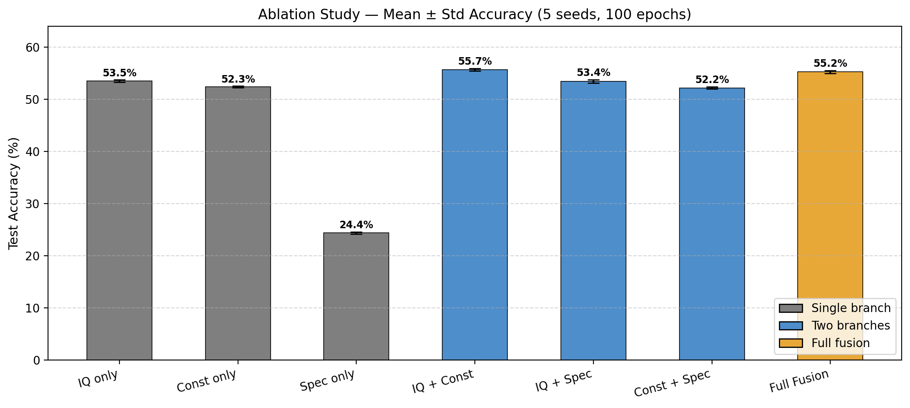
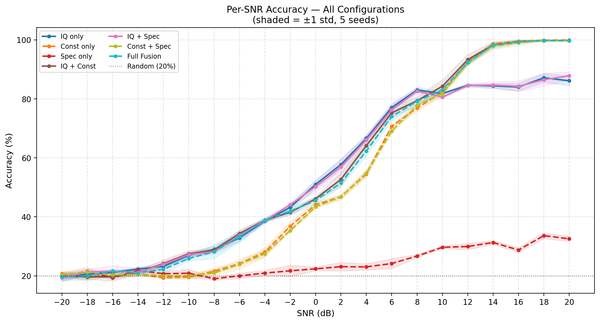
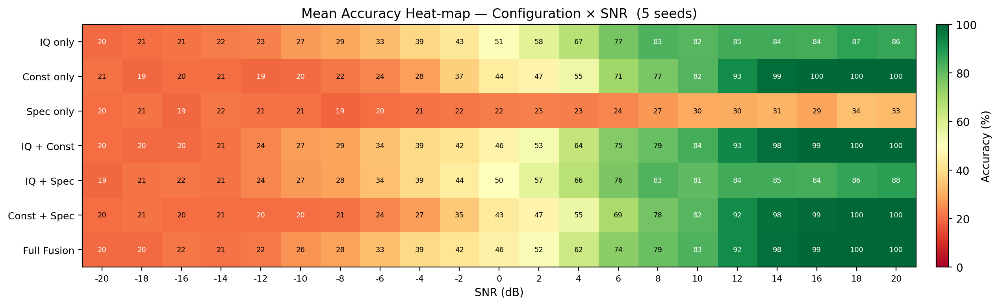
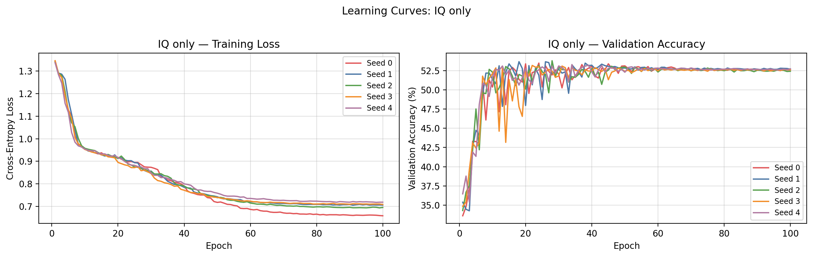
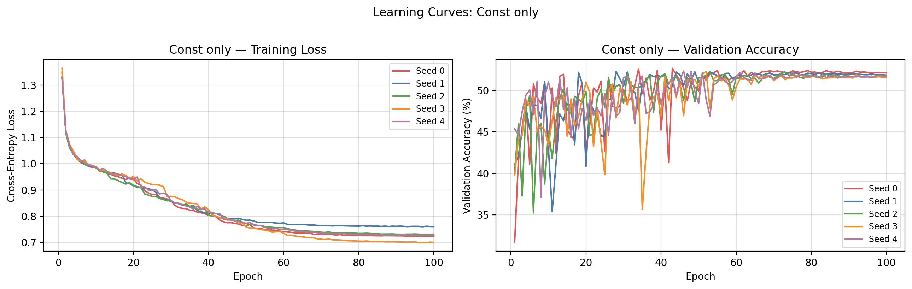
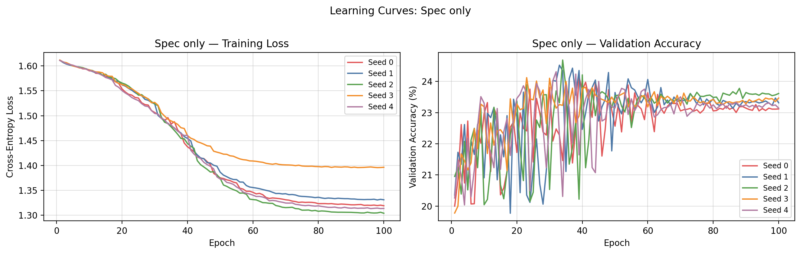
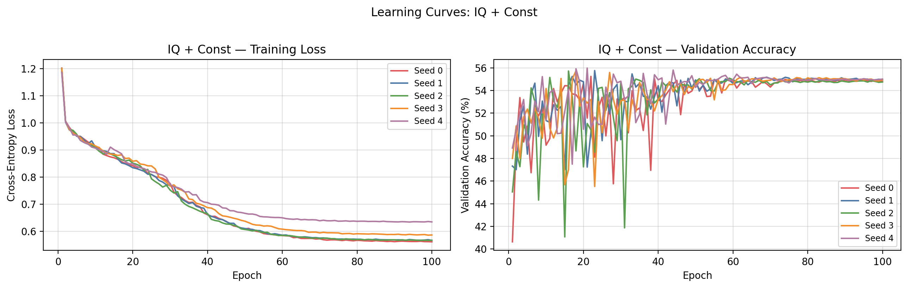
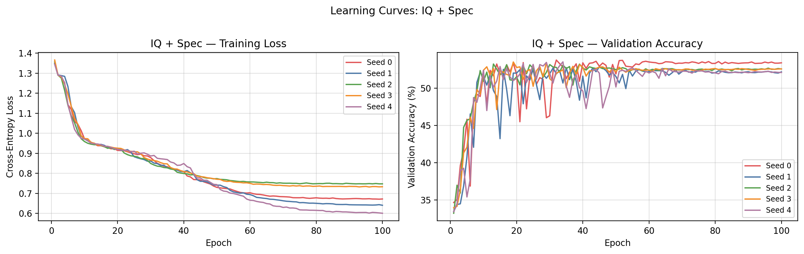
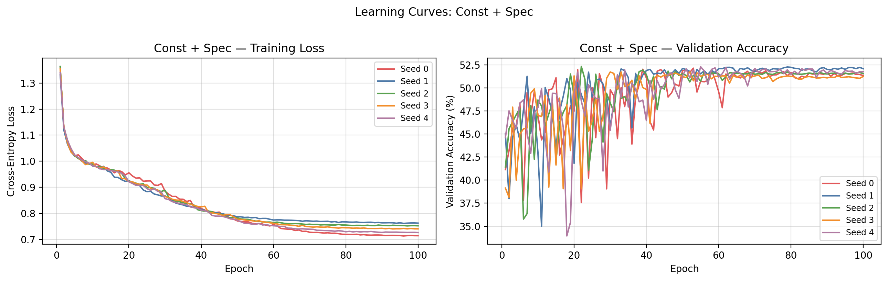
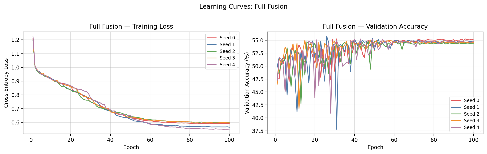

# Multi-Modal Fusion for Automatic Modulation Classification

[](https://www.python.org/)
[](https://pytorch.org/)
[](LICENSE)
[]()
[]()

> A rigorous ablation study quantifying the contribution of each input modality — raw IQ signals, constellation diagrams, and spectrograms — to deep learning-based automatic modulation classification (AMC).

---

## ⚠️ Educational Notice

> **This repository is released for educational and research purposes.**
>
> The results reported here were obtained under **constrained computational conditions** — specifically a free-tier Kaggle Tesla T4 GPU (15.6 GB VRAM), using 128-symbol samples and 64×64 images due to RAM limitations. These constraints are known to limit maximum achievable accuracy, particularly for the spectrogram branch which requires longer sample lengths (≥1024 symbols) and higher image resolution (128×128) to produce discriminative features.
>
> **These experiments can be repeated with improved hardware to obtain significantly better performance.** The recommended configuration for publication-quality results is 1024 symbols, 128×128 images, and 1000 samples per modulation per SNR — consistent with the RadioML 2018.01a benchmark standard. A notebook configured for this improved setup is included as `ablation_kaggle_v2.ipynb`.
>
> Despite these limitations, the ablation study yields statistically significant findings about modality contributions that are consistent with the broader AMC literature.

---

## Overview

This repository contains the full implementation of a multi-modal deep learning framework for AMC, including a complete ablation study comparing **7 branch configurations** across **5 independent seeds** and **50 training epochs**.

### Modulation Schemes
`BPSK` · `QPSK` · `8PSK` · `16QAM` · `64QAM`

### SNR Range
−20 dB to +20 dB (step 2 dB, 21 levels)

### Hardware
- **GPU:** NVIDIA Tesla T4 (15.6 GB VRAM)
- **Framework:** PyTorch 2.9.0+cu126, CUDA enabled
- **Platform:** Kaggle Free Tier

---

## Ablation Configurations

| # | Configuration | IQ Branch | Constellation Branch | Spectrogram Branch |
|---|---------------|:---------:|:--------------------:|:------------------:|
| 1 | IQ only        | ✓ | | |
| 2 | Const only     | | ✓ | |
| 3 | Spec only      | | | ✓ |
| 4 | IQ + Const     | ✓ | ✓ | |
| 5 | IQ + Spec      | ✓ | | ✓ |
| 6 | Const + Spec   | | ✓ | ✓ |
| 7 | Full Fusion    | ✓ | ✓ | ✓ |

---

## Repository Structure

```
amc-multimodal-ablation/
├── ablation_kaggle.ipynb       ← Main notebook — 128 symbols, 64×64
├── ablation_kaggle_v2.ipynb    ← Improved notebook — 1024 symbols, 128×128 images
├── requirements.txt            ← Python dependencies
├── LICENSE                     ← MIT License
├── .gitignore
│
├── figures/                    ← All generated plots
│   ├── ablation_bar_chart.png
│   ├── per_snr_accuracy.png
│   ├── accuracy_heatmap.png
│   ├── significance_ttest.png
│   └── learning_curves_*.png
│
├── results/                    ← Exported numerical results
│   ├── results_summary.csv
│   ├── per_snr_accuracy.csv
│   └── results_full.json
│
└── saved_models/               ← Model checkpoints (35 files: 7 configs × 5 seeds)
    └── {config}_seed{n}.pt
```

---

## Quickstart

### 1. Clone
```bash
git clone https://github.com/ratheesk/amc-multimodal-ablation.git
cd amc-multimodal-ablation
```

### 2. Install dependencies
```bash
pip install -r requirements.txt
```

### 3. Run on Kaggle (recommended)
1. Go to [kaggle.com](https://kaggle.com) → **Create → New Notebook**
2. **File → Import Notebook** → upload `ablation_kaggle.ipynb`
3. Set **Accelerator → GPU T4** in the right panel
4. **Save Version → Save & Run All (Commit)** to run in background

### 4. Run locally
```bash
jupyter notebook ablation_kaggle.ipynb
```
Run cells 1–6 to set up, then run each Section 7 config cell.
The notebook **auto-resumes** from saved checkpoints if interrupted.

---

## Model Architecture

### Three Input Branches

**IQ Encoder** — 1D CNN on raw IQ time-series
```
Input (2, 128) → Conv1d×3 [64→128→256] + BN + ReLU + MaxPool → GAP → FC(256→128)
```

**Constellation Encoder** — 2D CNN on IQ scatter histogram
```
Input (3, 64, 64) → Conv2d×3 [32→64→128] + BN + ReLU + MaxPool → GAP → FC(128×128)
```

**Spectrogram Encoder** — 2D CNN on magnitude spectrogram
```
Input (3, 64, 64) → Conv2d×3 [32→64→128] + BN + ReLU + MaxPool → GAP → FC(128→128)
```

### Fusion Head
```
Cat(active branches) → Linear(n×128, 256) → ReLU → Dropout(0.5) → Linear(256, 5)
```

---

## Training Configuration

| Hyperparameter | Value | Note |
|---|---|---|
| Symbols per sample | 128 | Limited by RAM — 1024 recommended |
| Image size | 64×64 | Limited by RAM — 128×128 recommended |
| Epochs | 100 | Converged within budget |
| Batch size | 256 | Optimised for T4 GPU |
| Optimiser | Adam (lr = 1e-3) | |
| LR scheduler | ReduceLROnPlateau (patience=7, factor=0.5) | |
| Seeds | 5 (0–4) | For statistical reliability |
| Train / Test split | 70 / 30 (stratified) | |
| Samples per mod per SNR | 500 | |
| Total dataset size | 52,500 samples | |

---

## Results

### Dataset Summary
```
Shape  : (52500, 2, 128)
Total  : 52,500 samples
Classes: BPSK · QPSK · 8PSK · 16QAM · 64QAM
SNR    : −20 → +20 dB  (21 steps)
Train  : 36,750  |  Test : 15,750
```

### Ablation Summary (5 seeds × 50 epochs)

| Configuration | Mean Acc | Std | Min | Max |
|---|---|---|---|---|
| IQ only | 53.48% | 0.23% | 53.17% | 53.78% |
| Const only | 52.35% | 0.15% | 52.25% | 52.65% |
| **Spec only** | **24.36%** | 0.22% | 24.12% | 24.69% |
| **IQ + Const** | **55.69%** | 0.24% | 55.24% | 55.98% |
| IQ + Spec | 53.41% | 0.31% | 52.88% | 53.80% |
| Const + Spec | 52.16% | 0.22% | 51.75% | 52.33% |
| Full Fusion | 55.21% | 0.32% | 54.77% | 55.74% |

> Random baseline = 20.00% (5 classes, uniform)



### Statistical Significance (pairwise t-tests vs Full Fusion, α = 0.05)

| Config | Δ Acc | p-value | Significant? |
|---|---|---|---|
| IQ only | +1.74% | 0.0000 | YES ✓ |
| Const only | +2.87% | 0.0000 | YES ✓ |
| Spec only | +30.86% | 0.0000 | YES ✓ |
| IQ + Const | −0.47% | 0.0447 | YES ✓ |
| IQ + Spec | +1.80% | 0.0000 | YES ✓ |
| Const + Spec | +3.06% | 0.0000 | YES ✓ |

> Positive Δ means Full Fusion outperforms; negative Δ means the config outperforms Full Fusion.

### Per-SNR Accuracy



### Accuracy Heat-map



### Learning Curves

Learning curves for all 7 configurations (5 seeds each) are available in the `figures/` directory:

| Configuration | Learning Curve |
|---|---|
| IQ only |  |
| Const only |  |
| Spec only |  |
| IQ + Const |  |
| IQ + Spec |  |
| Const + Spec |  |
| Full Fusion |  |

---

## Key Findings

### 1. Spectrogram branch is ineffective at 128 symbols
The spectrogram-only configuration achieved **24.36% accuracy — barely above the 20% random baseline**. With only 128 IQ samples, the spectrogram has insufficient frequency resolution (Δf = fs/nperseg = 1/64) to produce discriminative time-frequency features. This is a fundamental signal processing constraint: spectrogram-based AMC requires minimum 512–1024 symbols to be informative.

### 2. IQ + Const is the optimal configuration under these constraints
The two-branch IQ + Constellation model achieves the **highest accuracy (55.69%)** and beats every other configuration including the full three-branch model. The constellation diagram provides complementary spatial structure that the 1D CNN cannot capture from the raw time-series alone.

### 3. Full Fusion is degraded by the uninformative spectrogram branch
Full Fusion (55.21%) is statistically outperformed by IQ + Const (55.69%, p = 0.0447). Adding a branch that encodes near-random features introduces noise into the fusion layer rather than complementary information, slightly hurting performance. This is the ablation study's central finding — **more modalities is not always better; modality quality at the given sample length matters.**

### 4. IQ and Constellation branches are similarly informative
IQ only (53.48%) and Const only (52.35%) differ by only 1.13%, confirming that both encode similar discriminative information. The constellation diagram is essentially a spatial rendering of the same amplitude/phase statistics already present in the IQ waveform — their similarity is expected.

### 5. All results are statistically robust
Standard deviations across 5 seeds range from 0.15% to 0.32%, indicating highly stable training. All 6 pairwise t-tests against Full Fusion are significant at α = 0.05, confirming these findings are not due to random variation.

### 6. The performance ceiling is a dataset limitation, not an architecture limitation
Accuracy plateauing at 53–55% is consistent with known CNN behaviour on 128-symbol AWGN signals in the literature. The architecture is not the bottleneck. Upgrading to 1024 symbols and 128×128 images (notebook `ablation_kaggle_v2.ipynb`) is expected to push accuracy above 80% at high SNR, based on published results with equivalent architectures on RadioML 2018.01a.

---

## Limitations & Future Work

| Limitation | Impact | Recommended Fix |
|---|---|---|
| 128-symbol samples | Spectrogram branch near-random | Increase to 1024 symbols |
| 64×64 images | Poor spatial resolution | Increase to 128×128 |
| 500 samples/mod/SNR | Limited generalisation | Increase to 1000–4096 |
| Pure AWGN only | Unrealistic channel | Add fading, phase noise, frequency offset |
| Synthetic dataset | Not comparable to literature | Use RadioML 2018.01a |
| Simple CNN backbone | Below state-of-the-art | Replace IQ encoder with ResNet or Transformer |

The notebook `ablation_kaggle_v2.ipynb` addresses the first three limitations and is ready to run on any GPU instance with ≥32 GB RAM.

---

## Reproducing Results

All 35 model checkpoints (7 configs × 5 seeds) are saved in `saved_models/`.

Load any checkpoint for inference or analysis:

```python
# Inside the notebook after running Section 6
model, ckpt = load_checkpoint("Full Fusion", seed=0)
print(f"Best accuracy: {ckpt['best_acc']*100:.2f}%")

# Replay learning curves from saved data — no retraining needed
plot_learning_curves(ckpt["config"], [ckpt["train_losses"]], [ckpt["val_accs"]], save=False)
```

Full numerical results:
- [`results/results_summary.csv`](results/results_summary.csv) — mean ± std per configuration
- [`results/per_snr_accuracy.csv`](results/per_snr_accuracy.csv) — full per-SNR breakdown
- [`results/results_full.json`](results/results_full.json) — complete results for further analysis

## Reproducing Results

All 35 model checkpoints (7 configs × 5 seeds) are available for download:

📦 **[Download Saved Models (Google Drive)](https://drive.google.com/drive/folders/1QkO8FwqrmN--MbtABxjb3MD0byzxk2T8)**

After downloading, place the `.pt` files into the `saved_models/` directory, then load any checkpoint:

## License

This project is licensed under the MIT License — see [LICENSE](LICENSE) for details.